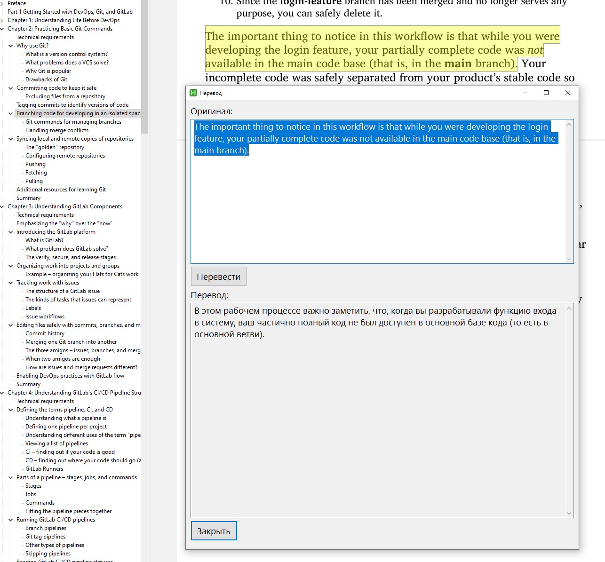

# 📘 AutoHotkey PDF Translator

[](LICENSE)  
[](https://www.autohotkey.com/)  
[](https://github.com/soimort/translate-shell)  

> 🔤 Instant translation of selected text in **SumatraPDF** from English to Russian—no frills, just convenience.  
> ✍️ Developed by [mirninec](https://github.com/mirninec)  

---

## ✨ Features  

-   🔍 Automatic translation on left mouse button release  
-   ⌨️ Copy-only mode (Ctrl + Left Click)  
-   🧹 Clean text from line breaks  
-   💬 Pop-up window with original text and translation  
-   🔁 Edit and re-translate functionality  
-   🪟 Remembers window position and size  

---

## 📸 Screenshot  

  

---

## 🧰 Requirements  

-   **Windows 10 or 11**  
-   [AutoHotkey v2](https://www.autohotkey.com/)  
-   [WSL (Windows Subsystem for Linux)](https://learn.microsoft.com/en-us/windows/wsl/)  
-   [translate-shell](https://github.com/soimort/translate-shell) installed inside WSL  

---

## ⚙️ Installation  

1. Install AutoHotkey v2 from the [official site](https://www.autohotkey.com/download/).  
2. Set up WSL (e.g., Ubuntu):  

    ```bash  
    wsl --install  
    ```  

3. Inside WSL, install translate-shell:  

    ```bash  
    sudo apt update  
    sudo apt install translate-shell  
    ```  

4. Clone the repository:  

    ```bash  
    git clone https://github.com/mirninec/autohotkey-pdf-translator.git  
    cd autohotkey-pdf-translator  
    ```  

5. Run `autohotkey-pdf-translator.ahk` by double-clicking or via autostart.  

---

## 🖱 How to Use  

| Action                     | Description                                                  |  
| -------------------------- | ------------------------------------------------------------ |  
| Select text with mouse     | Automatic translation                                        |  
| Ctrl + Select text         | Copy only (no translation), removes line breaks              |  
| Esc                        | Close translation window                                     |  
| "Translate" button in window | Re-translate edited text                                    |  

---

## 🧪 Notes  

-   Works only in `SumatraPDF` window (checks for `ahk_class SUMATRA_PDF_FRAME`).  
-   Uses `trans` via WSL, so an active internet connection is required.  
-   All temporary files are created in the script directory.  

---

## 📝 License  

This project is licensed under the [MIT License](LICENSE).  

---

> © [mirninec](https://github.com/mirninec) | Made with ❤️ and AutoHotkey  

---  